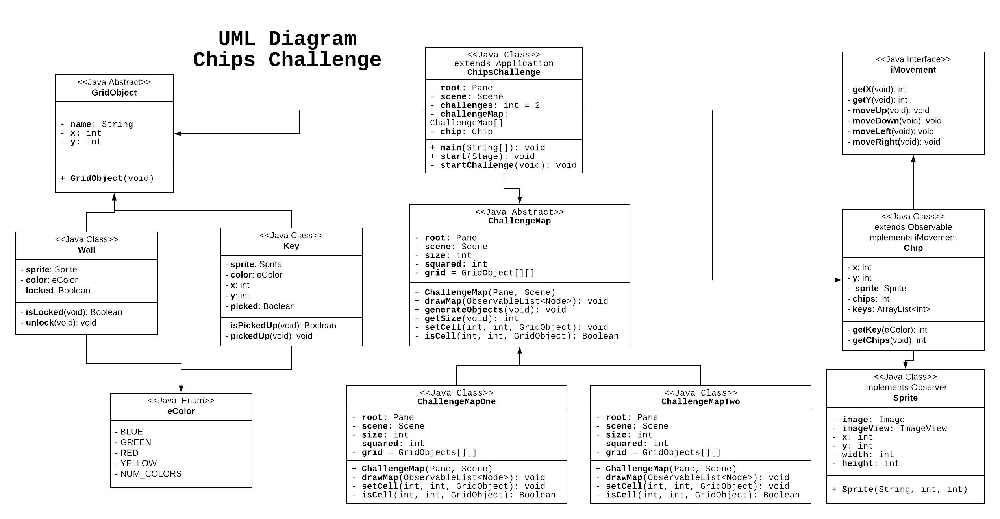
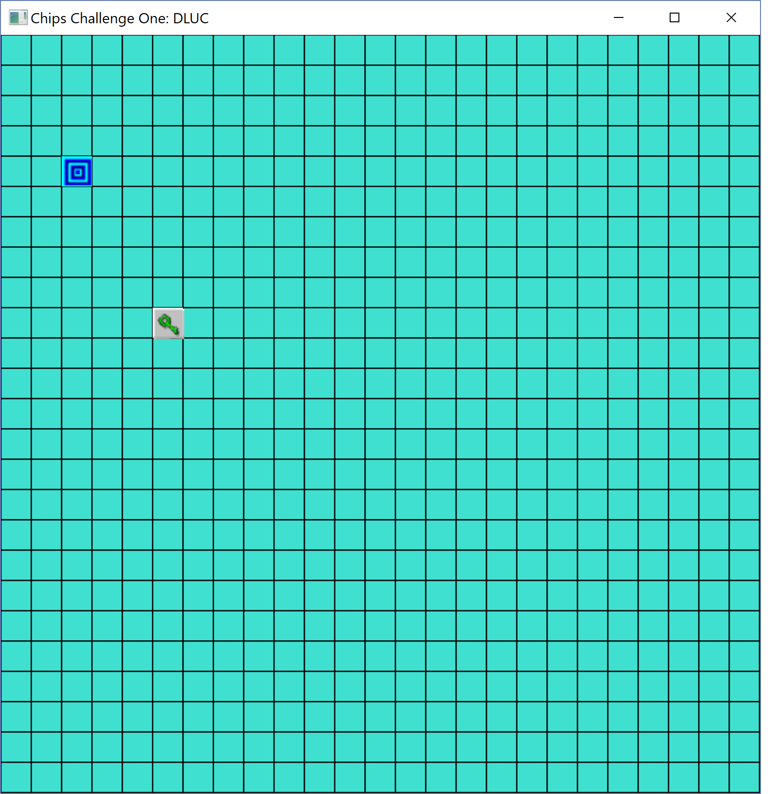

FA18-CSE-40793-01: Software Engineering Principles  
Homework 06: Chips Challenge  
--------------------------------------------------
### Author: Donald Luc
### Date: Fall 2018

UML Diagram:
-----------

Intermediate Accomplishments:  
----------------------------

### Complete Features:
- Created 2-Dimensional Grid
- Placed Chip, portal, and keys onto grid
- Move Chip (and change Chip image)

### Incomplete Features:
- Change grid cells to blankTile.PNG images
- Pick up keys
- Unlock walls
- Create map layouts
- Observer implementation of ImageViews
- Add Bugs
- Challenge completions and load next challenge

### Screenshots:
__Initial Game Load__:

__Move To Green Key__:

__Hidden Behind Green Key__:

Final Accomplishments  
---------------------

### Updated UML Diagram: 
  

### Final Design Thoughts:  
My final design can be broken up into two directories, the Challenges directory and the ChipMVC directory. In the ChipMVC directory, I implemented a MVC pattern where Chip.java is the model, ChipImage.java is the view that observes the model, and theh controller lies in ChipsChallenge.java in the higher directory. For the Challenges directory, it is a single class that is given a type of Grid class object that can be wither GridOne or GridTwo. The Grid classes are a 2-dimensional array of integers that are mapped to specific enums in eTiles that are then loaded with rescective images in TileImages. The Grid objects use inheritance for reuse of methods and member variables. In essence, ChipsChallenge.java is a controller for both subdirectories Challenges and ChipMVC that both have the models and views of the layout and character.
I would have liked to added more obstacles in my challenges such as water or a bug. Both challenges are just Chip running around collecting chips and keys. I also did not realize that Chip must collect all chips before finishing the game and as a result my game allows Chip to finish with only collecting the keys. That is why I added a scoreboard text since I thought the score could vary from level to level. I would have also liked to have a single switch case for the eTiles. I have one in Chip and Challenge but I think with more thought then I can single it down to only one switch case. I also wished I pulled the controller for Chip away from ChipsChallenge.java and put it as its own class so that the ChipMVC can be a standalone package.

### Design Patterns:

